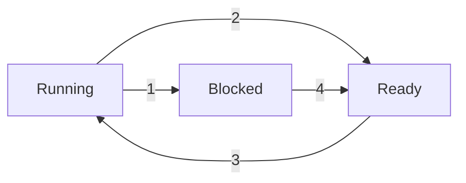

# 20190312

## What is an OS?
* Layer between application and hardware
* 3 parts
  * Kernel - with extensions and modules(like the lab)
  * Core runtime libraries
  * User interface
* Compiler, runtime libraries, and hypervisor are all **system software**
  * Compiler/runtime are "above" the OS
  * Hypervisor is "below"
* Kernel and hypervisor run in kernel mode, everything else is user mode

## OS Structure
* Monolithic (Unix, linux, BSD)
  * Entire OS runs as a single program in kernel mode
  * Collection of procedures are linked together into a single binary
  * Performant and easy for funtions to all call each other
  * One bug can crash the whole system
* Microkernel (Mac)
  * OS is split up into small well-defined modules
  * Only one module runs the kernel
  * All other modules run in user mode as a process 
    * Better if a bug happens
    * Slower because of switching processes
* Hybrids (Windows)
  * A handful of modules are combined in one executable for the kernel, and others are standalone modules

## Virtual machines and hypervisor
* Hypervisors can run multiple OSes
* An OS runs applications

> Probably the final:
> What are the differences between OS and hypervisor?
> What are the differences between monolithic/microkernel/hybrid architectures?

## Address space/memory
* What is in a block of memory? Whats the layout?

## Unix process creation `fork()`
* In the parent process `fork()` returns a value >0, which is the child `pid`
* In the child process the `fork()` return value is 0
```c
x = fork()
if (x==0) {
  print("Hey there") //this will only run in the child process
}
```

## Process State
* Execution state - what a process is currently doing?
  * **Running** - executing instructions on a CPU
    * Amount of processing allowing in this state is limited by how many CPUs there are
  * **Ready** - waiting to be assigned to a CPU
  * **Waiting/blocked** - waiting for an event to continue, like input or a resource becoming available, or sleeping while waiting to be woken up

### State transitions

1. Process blocks for input
2. Scheduler picks up another process
3. Scheduler picks the process
4. Input becomes available

## Process Table Entry (PCB)

## Modeling Multiprogramming
> CPU utilization = $1-p^n$

## Process to OS communication
> Quiz #1 - definitely in the midterm
> HW 1 problem 1
> HW 1 problem 3

## Multiprocessing VS multithreading
* In **multiprocessing** there are many processes running in user space, each containing one thread
* In **multithreading** there are multiple threads running in a single process, allowing them to share memory

> HW 1 problems 2, 4, 5

Threads VS processes
* When to use each
  * Threads when you need to share memory, fast context switching
* Structural differences
* User threading VS kernel threading
  * With kernel threading you can use multiple CPUs

## Semaphores
* Solve the lost wakeup problem
* Avoid race conditions
* Ideas
  * Save the number of wakeups

```c
int value = 1
// down()
value--;
if (value <0 ) sleep ();
//up
value++;
if (value <= 0) wakeup();
```

* `down()` and `up()` are **atomic operations**
  * `down()` requests a resource and waits until it's given one
  * `up()` releases a resource

> Quiz 2 - write a sequence of lines to create a deadlock
> HW 2 problem 1
> HW 2 problem 2

Differences between
* Busy-waiting and sleep/wakeup
* Different mechanisms presented (e.g. Peterson's solution)
* Semaphores nad mutexes
  * Semaphores protect N resources
  * Mutexes protect a single resource

## Scheduling
* Scheduling can happen when a process/thread
  * Is created
  * Exits a running state
  * ?

### First-come first-served (FCFS)
* Processes are assigned in the order they request
* *Non-preemptive*

* **Average turnaround time** is computed by taken the average of how long they each wait $\sum_{i=0}^{n}tfinished_n - tstarted_n$
  * If a long process is first, all have to wait so the average time is longer than if shorter jobs run first

### Shortest Job first
* *Non-preemptive*
  * Whenever a job needs to be scheduled the shortest job runs

### Round Robin

### Priority

### Scheduling periodic process
To check if perioic event are schedulable: 
$$\sum_{i=1}^{m} \frac{c_i}{c_p} \leq 1$$

| Process | Period (p) | Exec time (c) |
| :-: | :-: | :-: |
| A | 50  | 30 |
| B | 100 | 20 |
| C | 150 | 30 |
| D | 200 | 8  |

$$ \frac{30}{50} + \frac{20}{100} + \frac{30}{150} + \frac{8}{200} \nleq 1$$

> HW 2 problem 3
> HW 2 problem 4